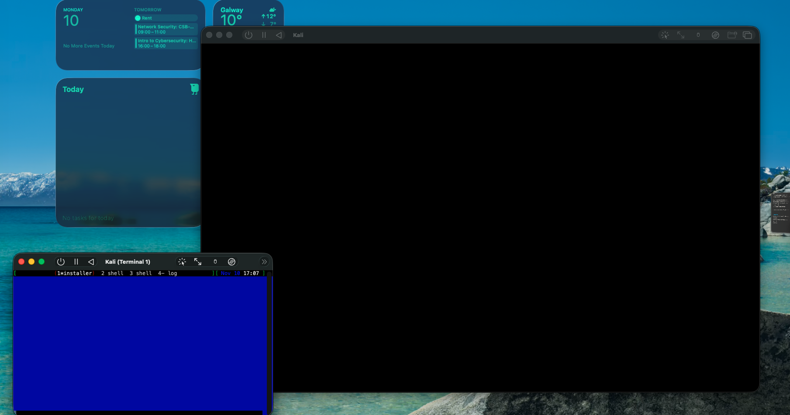
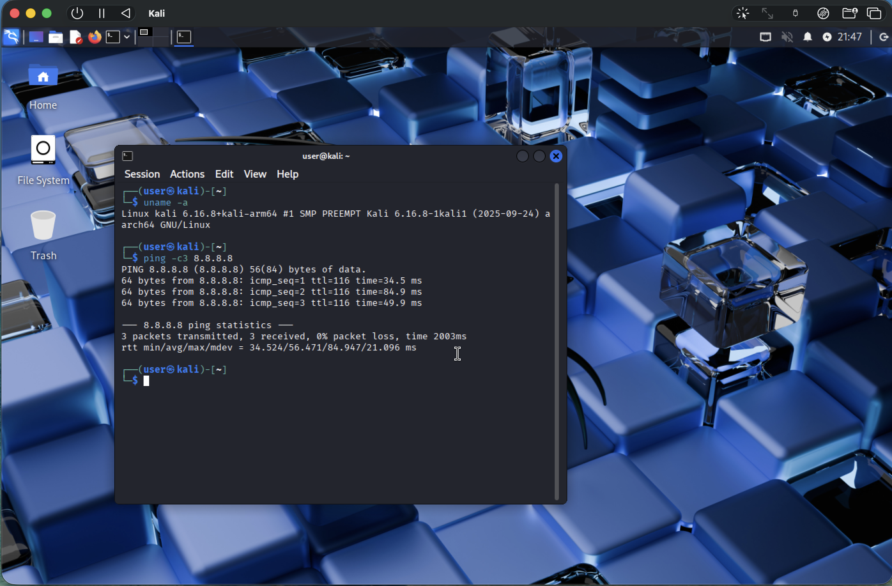

# VM Installations

Lab Report: Installing and configuration of Virtual Machines for Cyber Security Labs
Name: Vighnesh Arun Sadvilkar
Date: 10-11-2025
Environment: Host- MacOS, VMs- Kali Linux, Ubuntu, Windows11

# 1.Objective

Purpose: 
to create an isolated virtual environment to conduct cybersecurity experiments.

# 2.Tools
Host Machine:	macOS , 16 GB RAM, 256 GB SSD
Virtualization Software	UTM (Version: e.g., 4.5.1)
Guest OS:	Kali Linux 2025.2 ARM64
ISO / Image Used:	kali-linux-2025.2-arm64-apple-silicon.utm.zip
Network Type:	Shared (NAT)
Display Adapter:	virtio-gpu / SPICE
User Created:	user

# 3. Guidance 
https://www.youtube.com/watch?v=V6zoerB2zs4

# Steps Performed 

# Kali Installation

Step 1: Download an image file (iso) for mac from Official Kali website.

Step 2:Start setting up by creating new VM. Select Other .Select installation file. Create Shared folder.

Step 3: There was an error while installation. 'Video not connected' Response was Shown. This is an Known issue while using UTM and Kali. 

Step 4: Used youtube video in this link to resolve the issue.
https://www.youtube.com/watch?v=V6zoerB2zs4

Step 5: Inside the VM. run 
sudo apt update & sudo apt -y upgrade

Step 6: Get bidirectional Copy working
In VM settings of UTM turn it on select spice as option. 

In Kali VM terminal run following:
sudo apt install -y spice-vdagent spice-webdavd

Step 7: 
Reboot

Step 8:
As UTM doesnt supoort snapshots. Create an copy of .utm file.

# ScreenShots

Fig1. Orginal error where video was not working. 

Fig2. Kali Boot Screen

Fig3. Checking network connection by pinging.

# Learnings 
- Learned How to install VM on UTM
- Learned How to trouble shoot VM installation
- Learned the trick to properly install Kali on UTM mac.

# Conclusion
A fully functional Kali Linux ARM64 VM was successfully installed and configured using UTM on macOS.
The environment supports GUI interaction, bidirectional clipboard, internet access, and shared folders.

# References
Kali Linux ARM Documentation – https://www.kali.org/docs/arm/
UTM Official Documentation – https://docs.getutm.app
